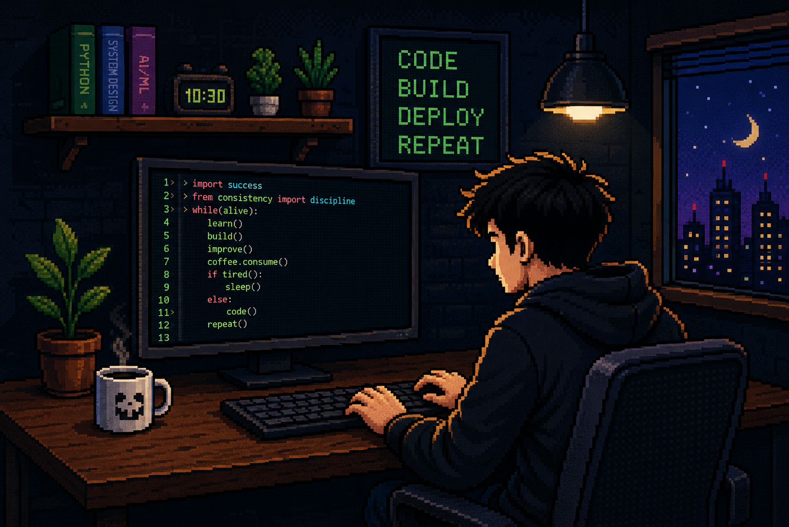

<table>
<tr>
<td width="52%" valign="top">

# `> Vinayak Bhat █`

### Software Engineer · AI/ML Engineer

```text
// Building secure, intelligent software systems
// from backend infrastructure to applied AI.
```

I'm an **AI & Machine Learning Engineering student** and a **Software Engineering Intern at IIIT Dharwad — CYRUS Research Group**, working on secure credential and access-management systems.

I build end-to-end products across **software engineering, machine learning, and AI security** — from architecture and experimentation to APIs, deployment, and user-facing applications.

🚀 **Currently exploring:** `AI Security` · `Intelligent Systems` · `Secure Identity` · `Applied ML`

</td>
<td width="48%" align="center" valign="middle">



</td>
</tr>
</table>

<p align="left">
  <a href="https://www.linkedin.com/in/vinayakbhat19"></a>
  <a href="https://github.com/vinayakbhat19"></a>
  <a href="mailto:vinayakkbhatt@gmail.com"></a>
</p>

---

## `> LANGUAGES & TOOLS_`

<p align="center">
  
</p>

---

## `> EXPERIENCE_`

<table>
<tr>
<td width="100%">

### 💼 Software Engineering Intern &nbsp; `CURRENT`

**IIIT Dharwad — CYRUS Research Group**  
`July 2026 — Present`

- Building components for a **secure credentials and access-management system**
- Working on **authentication mechanisms, access-control workflows, and secure identity infrastructure**
- Contributing to scalable identity-management solutions for trusted user and system interactions
- Collaborating with the research team on secure, reliable, production-oriented systems

</td>
</tr>
</table>

---

## `> FEATURED PROJECTS_`

<table>
<tr>
<td width="33%" valign="top">

### 🛡️ PromptShield AI
**Prompt Safety & Optimization Platform**

A modular AI security platform that analyzes prompts before they reach LLMs and detects prompt injection, jailbreak attempts, sensitive-data leaks, and source-code exposure.

`Python` `FastAPI` `SQLite`  
`Docker` `GitHub Actions`

<br><br>
<a href="https://github.com/vinayakbhat19/promptshield"></a>

</td>
<td width="33%" valign="top">

### 🧾 GSTVision AI
**Intelligent Invoice Verification**

AI-powered invoice verification using Gemini Vision and Tesseract OCR with GSTIN validation, duplicate detection, fraud-risk scoring, and automated PDF reports.

`Python` `FastAPI` `Gemini Vision`  
`Tesseract OCR` `GST API`

<br><br>
<a href="https://github.com/vinayakbhat19/aigstverify"></a>

</td>
<td width="33%" valign="top">

### 🧠 SupplyChainAI
**Supply Chain Risk Intelligence**

Temporal GNN combining **GCN + GAT + LSTM** to model dynamic shipping networks and forecast future disruption risk from historical supply-chain data.

`Python` `PyTorch` `PyG`  
`FastAPI` `React`

<br><br>
<a href="https://github.com/vinayakbhat19/SupplyChainAI"></a>

</td>
</tr>
</table>

---

## `> INTERESTS_`

<p align="center">


</p>

---

## `> GITHUB ACTIVITY_`

<p align="center">
  
</p>

---

## `> CONTRIBUTION SNAKE_` 🐍

<p align="center">
  <picture>
    <source media="(prefers-color-scheme: dark)" srcset="https://raw.githubusercontent.com/vinayakbhat19/vinayakbhat19/output/github-contribution-grid-snake-dark.svg"/>
    <source media="(prefers-color-scheme: light)" srcset="https://raw.githubusercontent.com/vinayakbhat19/vinayakbhat19/output/github-contribution-grid-snake.svg"/>
    
  </picture>
</p>

---

<div align="center">

### `while(alive) { learn(); build(); improve(); }`

**Thanks for stopping by 👋 · Let's build something awesome.**

</div>
